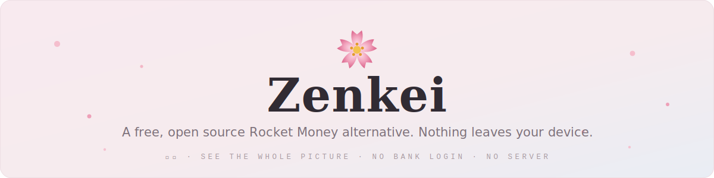
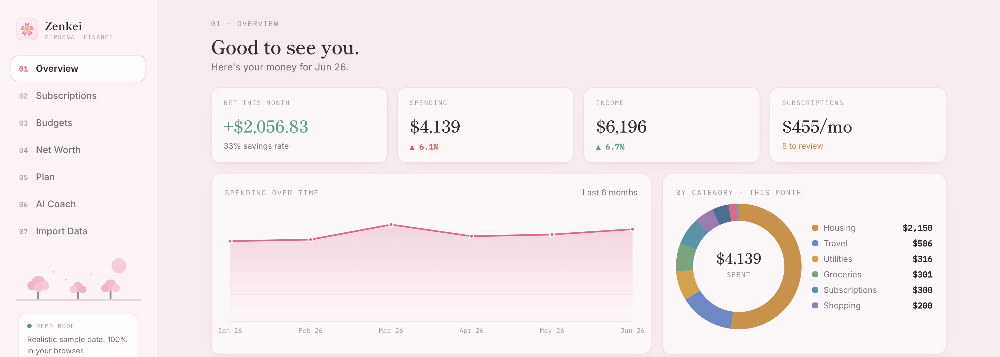

<p align="center">
  
</p>

<p align="center">
  <a href="./LICENSE"></a>
  
  
  
  
  
  
</p>

**Zenkei is a free, open source alternative to Rocket Money that runs entirely in your browser.** It finds your subscriptions, tracks your spending, watches your budgets, and coaches you on your money. There is no bank login, no account, no subscription fee, and no server. Your data never leaves your device.

> Try it live: **[akadigari.github.io/zenkei](https://akadigari.github.io/zenkei/)** (also at [zenkei.vercel.app](https://zenkei.vercel.app))

## Why I built this

Apps like Rocket Money are genuinely useful, but they want your bank credentials before they show you anything, and the best features cost $6 to $12 a month. I wanted to know how much of that product you could get with zero trust and zero dollars. It turns out the interesting parts, like finding recurring charges and parsing messy statements, are just algorithms. They can run on your own machine. So I built them.

Zenkei is the result. It does the core of what a paid subscription tracker does, for free, without ever seeing your data.

## Screenshots

<p align="center">
  
</p>

## What you get

| Tab | What it does |
| --- | --- |
| **Overview** | Spending by category, spending over time, top merchants, recent activity |
| **Subscriptions** | Finds recurring charges on its own, flags overlapping streaming services, duplicate gym memberships, and price hikes, and lets you simulate cancelling them |
| **Budgets** | Spend vs. budget for every category, with limits you can edit in place |
| **Net Worth** | Assets vs. liabilities, an allocation chart, and a trend line |
| **Plan** | A "safe to spend" number, savings goals with time-to-goal, and a 6 month cash flow forecast |
| **AI Coach** | A money health score out of 100, plain English insights, and a chat that answers questions about your money. All of it is computed on your device. Add your own OpenAI key if you want a written coaching note |
| **Import** | Paste a CSV, paste messy statement text, upload a file, or upload a screenshot. Screenshots are read with OCR right in your browser |

Everything saves automatically in your browser. Imported transactions, budgets, and goals survive a refresh. And with no input at all, Zenkei loads with six months of realistic sample data, so you can play with every feature before importing anything.

It works on your phone too. The sidebar becomes a top bar, cards stack into one column, and wide tables scroll sideways.

## How the subscription detector works

There is no merchant database and no hardcoded list of services. It works off the shape of your data ([src/lib/subscriptions.ts](src/lib/subscriptions.ts)):

1. **Group** charges by a cleaned up merchant key, so `NETFLIX.COM 0199` and `Netflix.com` count as the same thing. Rent is excluded, since it repeats but is not a subscription.
2. **Check the amounts.** A group needs 3 or more charges that stay within about 25% of the median. Subscriptions cost the same every time. Coffee runs don't.
3. **Check the timing.** The typical gap between charges has to land near weekly, biweekly, monthly, quarterly, or yearly, and most of the gaps have to actually fit that rhythm. Otherwise it's just a store you visit a lot.
4. **Flag the suspicious ones:** price increases, 3 or more streaming services, 2 or more gym memberships, and anything unusually expensive.

## How the parser works

The import tab takes almost anything ([src/lib/parser.ts](src/lib/parser.ts)). It sniffs your input and picks one of two modes:

- **CSV mode.** It detects the delimiter, reads the header row if there is one, and guesses missing columns: the first cell that parses as a date, the longest non-numeric cell as the description, the rightmost money-looking cell as the amount. Separate debit and credit columns work too.
- **Freeform mode.** For messy pasted statement text, it scans each line for a date and a trailing amount. Whatever is left over becomes the description. `CR` and `DR` marks, parentheses, and income words like payroll or refund decide the sign.

Parsed rows then run through a keyword categorizer (about 250 merchant keywords across 12 categories) and a cleaner that strips card jargon, store numbers, and trailing state and zip codes. If you paste an OpenAI key, an LLM can do the parsing instead, and if that call fails it falls back to the built-in parser.

## Limits

Being upfront about what it can't do:

- The detector needs to see a charge **3 or more times**, so a subscription you started last month won't show up yet. Monthly billing needs about three months of history.
- Guessing the sign of an unsigned amount is a heuristic. A refund from a merchant with no income words in the row will read as spending.
- OCR quality depends on the screenshot. A clean, cropped shot of just the transaction table works well. A photo of your monitor does not.
- The Net Worth tab shows sample accounts for now. There is no way to edit them yet.
- Auto-save lives in one browser's local storage. It does not sync between devices, and clearing site data clears Zenkei.
- The categorizer is keyword based and tuned for US merchants and English.

## Privacy

No backend, no analytics, no tracking. Your transactions, budgets, and goals live in your browser's local storage and nowhere else. The only network requests are Google Fonts, the OCR library (loaded from a CDN the first time you import a screenshot), and, only if you paste your own OpenAI key, requests that go straight from your browser to OpenAI. The key is kept in memory for the current tab and never stored.

## Run it locally

```bash
npm install
npm run dev      # dev server at http://localhost:5173
npm run build    # type-checks and builds to dist/
npm run preview  # serves the production build
```

Built with React 18, Vite, and TypeScript. There is no chart library. The donut, the area chart, and the score ring are hand-built SVG components in [src/components/charts](src/components/charts). New to the codebase? Start with [docs/CODE_TOUR.md](docs/CODE_TOUR.md). And if you think in Python like I do, [docs/TS_NOTES.md](docs/TS_NOTES.md) maps every TypeScript idea in this repo to its Python equivalent.

## Deploy your own

Zenkei builds to a plain static `dist/` folder, so it hosts anywhere. On Vercel: import the repo, keep the **Vite** preset (build `npm run build`, output `dist`, already pinned in [vercel.json](vercel.json)), and deploy. No environment variables needed.

## Disclaimer

Zenkei is a personal project, **not financial advice**. It ships with sample data so you can explore it without importing anything.

Rocket Money is a trademark of its respective owner. Zenkei is an independent, open source project and is **not affiliated with, endorsed by, or sponsored by** Rocket Money or Rocket Companies. Any mention of Rocket Money is for comparison only.

## License

MIT, see [LICENSE](./LICENSE).
